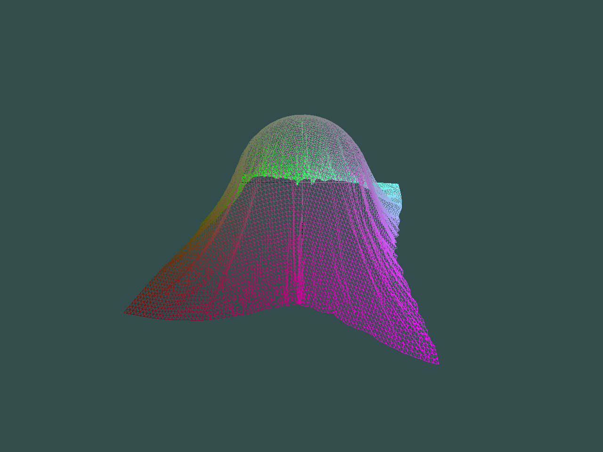

# ClothGPU

Testing pyOpenCL in a simple GPU simulation.
On my computer, the GPU version can hundle 10 000 points in real time. To compare, 100 points on CPU don't run in realtime (with Python).



Forked from [PyGLViewer](https://gitlab.inria.fr/elan-public-code/pyglviewer), here is the original README:

# PyGLViewer

This is a simple python OpenGL viewer designed to have a quick visualization of the results of the simulations. The goal is *not* to do efficient/marvelous renderings, although you can tune a bit the viewer if you want.

## Authors

* Mickaël LY
* Thibaut METIVET

## How to use

### Dependencies 

* Python3
* GLFW3
* OpenGL
* OpenCL (added for ClothGPU simulation)

To install them (on Ubuntu) :
```
sudo apt-get install freeglut3 freeglut3-dev mesa-utils python3 python3-setuptools libglfw3-dev libassimp-dev python3-pip
pip3 install numpy Pillow PyOpenGL PyOpenGL-accelerate glfw scipy pyopencl
```

### Test

Running
```
python3 main.py
```
should play one of the default base scenarios.

### Making your own scenarios

The examples of the file `scene.py` are quite self explanatory. 
